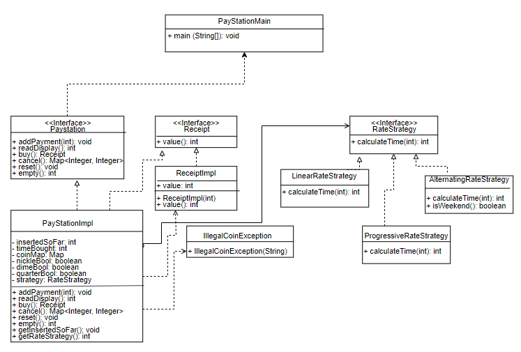

# PayStation Lab 4 

## Requirements 

The requirement for Lab 4 was to develop a main program which could show clients how PayStation works.
To fully implement PayStation, we needed to have:
1) The ability accept coins for payment. 5, 10, and 25 cents accepted only.
2) The ability to show time bought on display.
3) The ability to print a parking receipt which shows time when client wishes to buy.
4) The ability to print total returned coin values and number of each coin type when client wishes to cancel
5) The ability to for clients to pick from one of three rate strategies Linear, Progressive, and Alternating.
The default rate strategy is Linear unless the client specifies otherwise. The rate strategy can be switched during runtime. 

We implemented everything that was asked to be implemented. We tested that all 5 options in the main program functioned properly by testing the capabilities of each option on our personal machines and ensuring that they completed their desired tasks. 
The rate strategy was implemented through the compositional model. We chose this model because it offered the most flexibility. Even though it did take more time than some of the other models presented, it ultimately allowed us to implement more features of PayStation. 
One of the most important features that the compositional model helped us implement was the ability to change the rate strategy during runtime. 

## Team Work 

Our team consisted of Saad and Aidan. We collaborated by determining what needed to be implemented and why, when, and how it needed to be implemented. Instead of working on entirely separate parts of the project, we both consulted each other for every feature that we needed to implement. This ensured that we would both have input on everything that was done for every part of the lab, giving us both a better understanding of the overall lab. We would communicate through text whenever either of us was busy but on the weekends or when we were both free, we talked through Discord since verbal communication allowed us to work quicker and more efficiently. Discord also allowed us to look over each other's work and point out potential modifications to each other's code. 
Saad (along with input from Aidan) added the Linear, Progressive, and Alternating rate strategies. He also added tests for the Linear and Progressive rate strategies. He also worked on the main program which served as the interface clients could use in order to see how PayStation works. 
Since we were both working together and consulting each other frequently, we were both working at pretty much the same pace as each other throughout the assignment. No one was faster or slower than the other so we did not have that problem. 
The README was written by Saad and, as mentioned before, the tests were written by Saad with help from Aidan. 
Both of us revised and modified the code where we needed to. We discussed revisions on Discord before we implemented them into our code.

## Testing

We utilized unit testing for this lab. Since we were already familiar with unit testing from lab 3, we thought it'd be the best route to go for this lab as well. 
A bug we discovered while testing the rate strategies was that the Progressive rate strategy was not functioning as intended. The Progressive rate strategy is supposed to change from the Linear rate strategy's equation to another equation after the user inputs an amount over 150 or $1.50, but our tests of the Progressive rate strategy showed us that our equation always remained as the Linear rate strategy. To solve this, we looked through the code and tried to find where the problem was, and we soon discovered it in PayStationImpl where our timeBought variable was only calculating the Linear rate strategy. We changed this so that timeBought calculated time depending on whichever rate strategy is being used. 
Saad wrote the code for the rate strategies and the tests for the associated code/rate strategies. 
The code for the rate strategies were written first and then we wrote the tests for the rate strategies afterwards. 

## Team Members
Saad Khan

Aidan Shea
